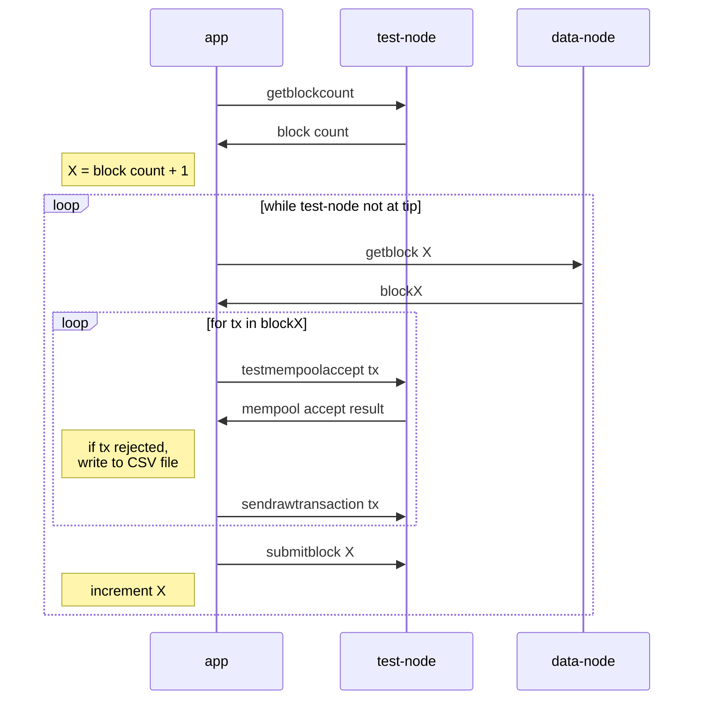

# non-standard tx finder

This is a quick-and-dirty tool to find transactions in the blockchain that are
non-standard according to Bitcoin Core's default mempool policy.

This tool requires two Bitcoin Core nodes: a `data-node` and a `test-node`.
The `data-node` only provides blocks (in theory, a block explorer API could be
used too, however, that's not implemented). The `test-node` is used to test if
it accepts the transactions in the block to its mempool. This requires the
node to not be aware of the block with the transaction yet. This can be
accomplished by syncing the node with `-stopatheight=X`. Once synced and
stopped, the node can be restarted with `-maxconnections=0` to stop if from
further synchronizing with other nodes.

Then, for each block the `data-node` knows about, but the `test-node` doesn't,
each transaction is added to the `test-node`'s mempool while recording any
failures and failure reasons. This uses the `testmempoolaccept` RPC to see if
the transaction would be accepted and then the `sendrawtransaction` RPC to
actually submit the transaction. Once all transactions are submitted, the full
block is submitted with the `submitblock` RPC. This cleans the mempool and
allows us to move on to the next block with transactions to test.

Known limitations:
- Transactions depending on a rejected transaction are rejected as `missing-inputs`
- Transactions might be rejected for multiple reasons. However, only one reason is returned
- Transactions rejected due to mempool limits (e.g. `too-long-mempool-chain`) can't be analyzed statically without the mempool state
- Does not report full-RBF replacements mined

## Setup

1. Fully synchronize a `data-node`.
2. Start a `test-node` with `-stopatheight=X` where X+1 is the height you want to test from.
3. Once the `test-node` is synchronized and has stopped, restart it with `-maxconnections=0`.
4. Copy the `config.toml.example` file to `config.toml` and fill in the RPC credentials for both nodes.
5. Run the rust application (e.g. `cargo run`).
6. Wait while the application submits each transaction and block to the `test-node`. Check progress in the `test-node`'s debug.log
7. Done. The application wrote a CSV file with information about each non-standard transaction.
